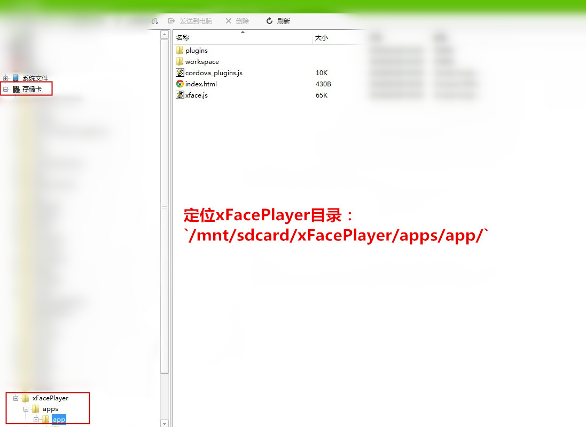
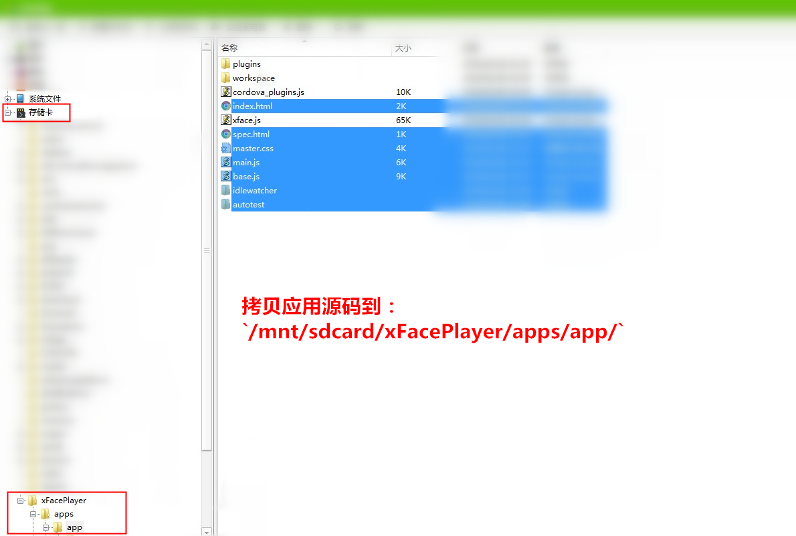

<!--
#
# Copyright 2012-2013, Polyvi Inc. (http://polyvi.github.io/openxface)
# This program is distributed under the terms of the GNU General Public License.
#
# This file is part of xFace.
#
# xFace is free software: you can redistribute it and/or modify
# it under the terms of the GNU General Public License as published by
# the Free Software Foundation, either version 3 of the License, or
# (at your option) any later version.
#
# xFace is distributed in the hope that it will be useful,
# but WITHOUT ANY WARRANTY; without even the implied warranty of
# MERCHANTABILITY or FITNESS FOR A PARTICULAR PURPOSE.  See the
# GNU General Public License for more details.
#
# You should have received a copy of the GNU General Public License
# along with xFace.  If not, see <http://www.gnu.org/licenses/>.
#
-->

# com.polyvi.xface.extra.player

## Installation

    xface plugin add com.polyvi.xface.extra.player

## Supported Platforms

- Android
- iOS

## Android

- **注意**Android平台的xFacePlayer只能在有外部存储设备（如:sdcard,TF card等）的设备上才可以使用
### 方法一：通过手机助手使用xFacePlayer
- 安装Android手机助手
- 连接Android设备
- 安装xFacePlayer.apk到设备上
- 定位xFacePlayer目录：`/mnt/sdcard/xFacePlayer/apps/app/`，请参见【图三】
- 拷贝应用源码到：`/mnt/sdcard/xFacePlayer/apps/app/`，请参见【图四】
- 重新启动xFacePlayer

 【图三】定位目录

 

 【图四】导入应用

 

### 方法二：通过命令使用xFacePlayer
- 安装Android的运行环境
- 连接Android设备，在命令行下输入`adb devices`，查看设备是否连接成功
- 安装xFacePlayer.apk到设备上，在命令行下输入`adb install path`(path是xFacePlayer.apk的完整路径，例如：在windows系统下输入`adb install C:\xFacePlayer.apk`)
- 通过push命令将应用源码拷贝到`/mnt/sdcard/xFacePlayer/apps/app/`路径下，在命令行下输入`adb push 应用源码的完整路径 /sdcard/xFacePlayer/apps/app`（例如在windows系统下输入：`adb push C:\testapp /sdcard/xFacePlayer/apps/app`）
- 重新启动xFacePlayer

## iOS

- 安装同步助手(或iTools等类似工具)
- 连接iOS设备
- 安装xFacePlayer.ipa到设备上
- 定位xFacePlayer目录：`Documents/xface_player/apps/helloxface/`， 请参见【图一】
- 拷贝应用源码到：`Documents/xface_player/apps/helloxface/`， 请参见【图二】
- 重新启动xFacePlayer

 【图一】定位目录

 

 【图二】导入应用

 
