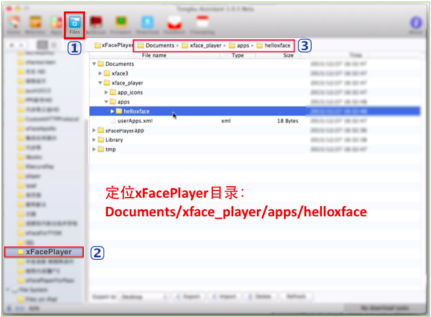

<!--
#
# Copyright 2012-2013, Polyvi Inc. (http://polyvi.github.io/openxface)
# This program is distributed under the terms of the GNU General Public License.
#
# This file is part of xFace.
#
# xFace is free software: you can redistribute it and/or modify
# it under the terms of the GNU General Public License as published by
# the Free Software Foundation, either version 3 of the License, or
# (at your option) any later version.
#
# xFace is distributed in the hope that it will be useful,
# but WITHOUT ANY WARRANTY; without even the implied warranty of
# MERCHANTABILITY or FITNESS FOR A PARTICULAR PURPOSE.  See the
# GNU General Public License for more details.
#
# You should have received a copy of the GNU General Public License
# along with xFace.  If not, see <http://www.gnu.org/licenses/>.
#
-->

# com.polyvi.xface.extra.player

## Installation

    xface plugin add com.polyvi.xface.extra.player

## Supported Platforms

- iOS

## iOS

- 安装同步助手(或iTools等类似工具)
- 连接iOS设备
- 安装xFacePlayer.ipa到设备上
- 定位xFacePlayer目录：`Documents/xface_player/apps/helloxface/`， 请参见【图一】
- 拷贝应用源码到：`Documents/xface_player/apps/helloxface/`， 请参见【图二】
- 重新启动xFacePlayer

 【图一】定位目录

 

 【图二】导入应用

 
